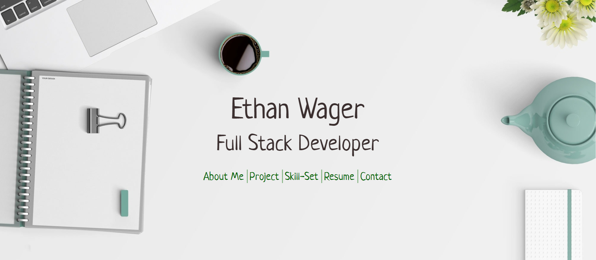

# Portfolio

A showcase of my work
[Live Link](https://ewager1.github.io/Portfolio/)

## Description

A portfolio that displays my best projects, my resume, and a way to contact me. I am looking for a jr. dev job, so please don't hesitate to reach out if you think we could be a good fit!

## Thank You

Thank you to michalsnik for the great aos animations library. Not only do the animations look great, they were easy to implement and the documentation was clear and robust.

[aos animations](https://github.com/michalsnik/aos)
